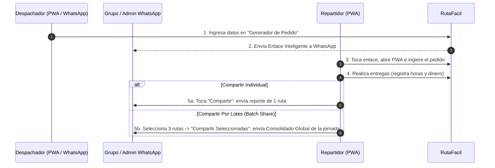

# Diseño de Producto: Asignación, Recepción y Rendición por Lotes/Individual desde WhatsApp

**Fecha:** 2026-07-22 (Actualizado)  
**Proyecto:** RutaFácil  
**Objetivo:** Permitir a despachadores/administradores asignar pedidos enriquecidos desde WhatsApp, y permitir a los repartidores cargar el pedido con 1 toque y **rendir cuentas individualmente o por lotes (múltiples rutas consolidadas)** al despachador vía WhatsApp.

---

## 1. Arquitectura General ($0 Costo / Client-Side)

El sistema funciona 100% en el cliente (PWA) utilizando **Enlaces Inteligentes (Smart Links)** y **Generación de Reportes Consolidados por WhatsApp**.

---

## 2. Estructura del Reporte Individual (1 Ruta)

> 📊 **RENDICIÓN DE DESPACHO Y RECORRIDO**  
> 📋 **Ruta:** Ruta 22/07 · 16:30  
> 🏍️ **Vehículo:** Moto | 📏 **Distancia:** 12.4 km | ⏱️ **Duración:** 45 min  
>   
> ----------------------------------------  
> 💵 **Total Cobrado:** $150,000  
> ⛽ **Total Viáticos Otorgados:** $15,000  
> 💰 **BALANCE NETO A ENTREGAR:** $135,000  
> ----------------------------------------  
>   
> ✅ **DETALLE DE ENTREGAS (3/3):**  
> 1. [16:45] Calle 10 #5-20 (Cobrado: $50.000 | Viáticos: $5.000)  
> 2. [17:05] Cra 15 #80-12 (Cobrado: $60.000 | Viáticos: $5.000)  
> 3. [17:25] Av. Chile #10-30 (Cobrado: $40.000 | Viáticos: $5.000)  
>   
> 🚀 *Generado automáticamente desde RutaFácil*

---

## 3. Estructura del Reporte por Lotes (Batch Share - Múltiples Rutas)

Cuando el repartidor activa la selección por lotes en el historial y elige varias rutas:

> 📑 **CONSOLIDADO GLOBAL DE DESPACHOS (3 Rutas)**  
> 📅 **Fecha del Reporte:** 22/07/2026  
> 🛣️ **Recorrido Total:** 34.8 km | 📦 **Entregas Totales:** 8 paradas  
>   
> ========================================  
> 💵 **TOTAL COBRADO ACUMULADO:** $380,000  
> ⛽ **TOTAL VIÁTICOS ACUMULADOS:** $40,000  
> 💰 **BALANCE GENERAL A ENTREGAR:** $340,000  
> ========================================  
>   
> 📋 **DESGLOSE POR RUTA:**  
>   
> 🔹 **Ruta 1 (Mañana · 09:15):** 3 paradas | 12.0 km  
>   • Cobrado: $120.000 | Viáticos: $15.000 | Balance: $105.000  
>   
> 🔹 **Ruta 2 (Tarde · 14:00):** 3 paradas | 14.5 km  
>   • Cobrado: $160.000 | Viáticos: $15.000 | Balance: $145.000  
>   
> 🔹 **Ruta 3 (Noche · 18:30):** 2 paradas | 8.3 km  
>   • Cobrado: $100.000 | Viáticos: $10.000 | Balance: $90.000  
>   
> 🚀 *Generado automáticamente desde RutaFácil*

---

## 4. Integración en la Interfaz de Usuario

1. **En cada ítem del Historial (`HistoryItem`):**
   * Añadir botón de acción con icono de compartir `FaShareNodes` junto a los botones de ver detalle, editar y eliminar.
2. **En la barra inferior de selección por lotes (`HistoryPanel.tsx`):**
   * Al seleccionar varias rutas, junto al botón de *"Eliminar (X)"*, aparece el botón primario **"📲 Compartir Seleccionadas (X)"**.
3. **En el modal de detalle (`RouteDetailModal.tsx`):**
   * Botón destacado en la cabecera para compartir esa ruta puntual.
